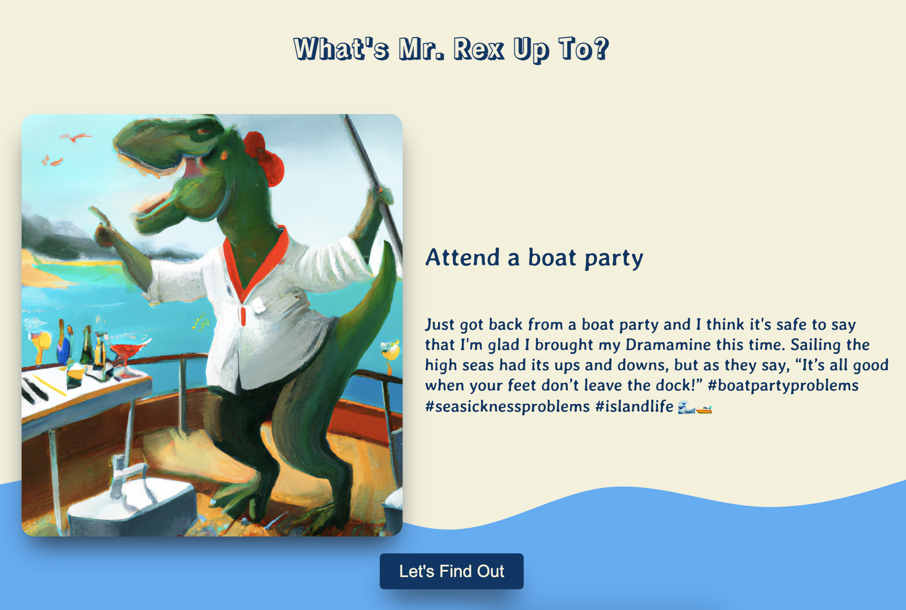
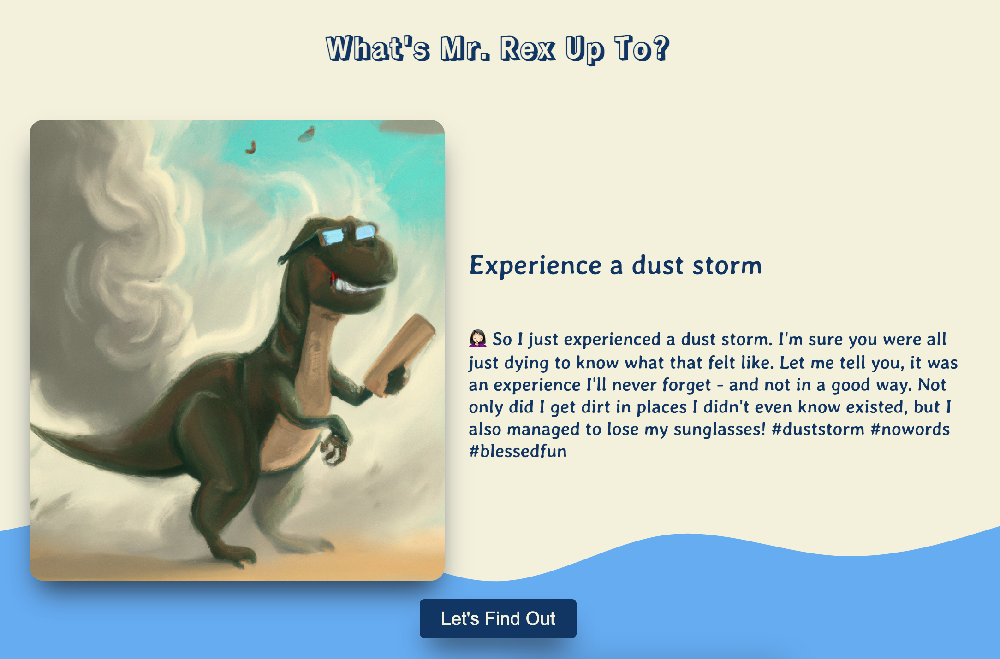
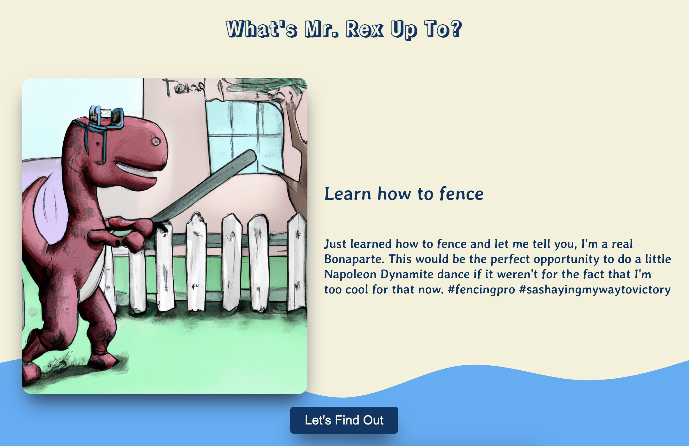

# Mr. Rex Website

## About

Mr. Rex, is a loving, witty, and free-spirited teacher on summer holiday. Having survived the threat of extinction, he wants to enjoy his second chance at life by crossing off as many things from his bucket list as possible.

In this project, I made a small website that uses various APIs to craft a Instagram like post for Mr.Rex and an AI generated image to pair it with.

### Steps

- **Step 1**: With fetch() API, I used the [bucket list API](https://api-ninjas.com/api/bucketlist) from API Ninjas to determine an activity for Mr. Rex to do.
- **Step 2**: I then call getCaption() and getImage() which use the topic and a pre-defined prompt to feed into OpenAI's API. In the prompt, I define the tone of the caption and the style of the image I desire.

## Run Locally

- python3 -m http.server
- http://localhost:8000/

## Examples

### Bucket List 1: Attend a Boat Party

### Bucket List 2: Experience a Dust Storm

### Bucket List 3: Learn How To Fence

